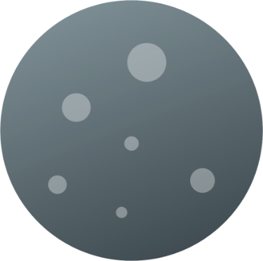
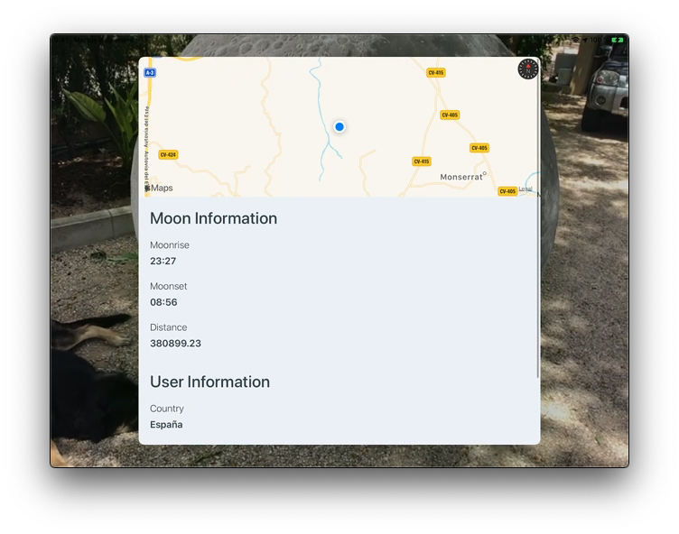

# Lluna - Observe and interact with the moon

## Basic Description
--------------------
Created for AppleJam Hackathon [__more info__](https://discord.com/channels/710223508382416976)

#### Name's origin
In [Valencian](https://en.wikipedia.org/wiki/Valencian_language) (_my native language_), Lluna (_/ˈʎu.na/_) means moon. Here, in Valencia, is common talk about:
 > A la Lluna de Valencia
 > "On Valencia's Moon"

#### Views
1. Walkthrough: Request all needed permissions.
2. CameraView: Is the main view, shows to the user all the AR elements and allow to the user interact with it.
3. Detail: this view offers the posibility of read more information about the moon relative to his Geo-location

#### App Permissions
1. Camera, this is necessary to show and interact with AR elements.
2. Location, is a optional permission, uses the user coordinates to determinate the distance between his position and the moon.

#### Other Info
- No third party libraries have been used for the App.
- Network and Camera layer, can be reused on any other projects, were created with code reuse in mind.
- No Storyboards (only .xib).
- API [more info](https://ipgeolocation.io/documentation/astronomy-api.html) 

## Functionallity description
-----------------------------
- The App starts at the Walkthrough. It request the necessary permissions to the user (user can skip it partially). When the permissions request finish, this view navigate to CameraView, calling to his configurator,  which setups the CameraView, CameraPresenter (this one is not used, becase camera delegate the hardwork to reusable components).
- The controller (CameraView) check the minimum necessary permissions (Camera) and configure the view based on it. Therefore the CameraView only shows the ARCamera if this permission is allowed in other cases a text and a button is showed.
- The CameraARView, contains a ARSceneView (Lluna Scene) it manipulate all the Scene elements and setup on the CameraARView.
- The CameraAR have only one node _moon_ and is putted on the screen when LlunaScene detect some plane on the environment.
- The Moon node is managed by Lluna Scene, and allow to the user do tap gestures.
- The Detail view is showed when user taps on the node, and shows some information about the user and the moon.
- The network calls are wrapped in DetailView, which uses one service: Networking Service.
- The NetworkingService uses URLSessionDataTasks to download the content from the API.
- The LocationService uses native CoreLocation API and offer the data with a shared instance.

## Future Improvements
-----------------------------
- Control the device rotation to avoid some inconsistent behaviors.
- Show more interesting information, such as graphic informaiton about where is the moon relative to the Earth.

## DEMO
-----------------------------

## Contact
-----------------------------
Questions, suggestions, comments are welcomed 🎉 [sergio@sergiofresneda.com](mailto://sergio@sergiofresneda.com)
